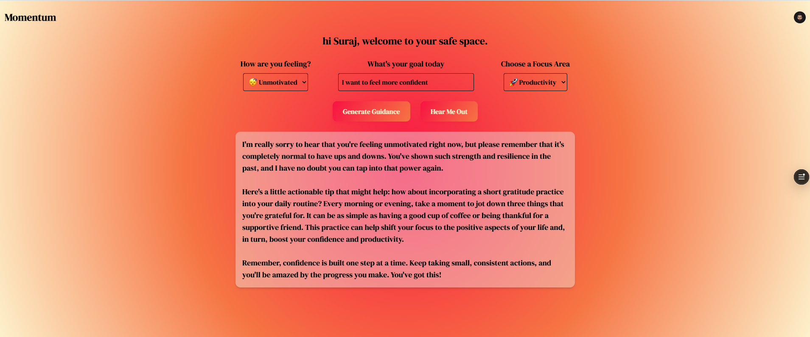
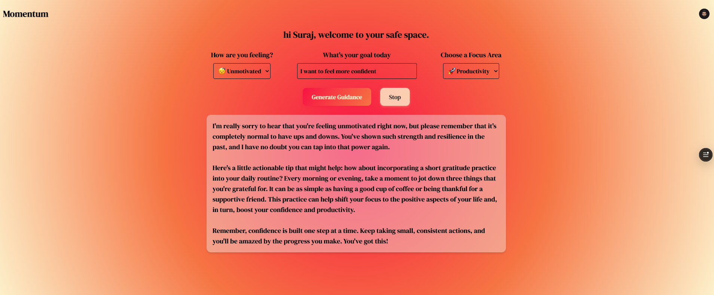

# Momentum

Momentum is a Next.js-based motivational guidance app deployed on Vercel. It allows users to generate personalized motivational messages based on their mood, goal, and focus area and listen to the guidance using an integrated text-to-speech feature.

## Features

- **Personalized Motivation:**  
  Generate custom motivational messages by selecting your current mood, specifying your goal, and choosing a focus area.
  
- **Text-to-Speech:**  
  Convert the motivational guidance into audio using a high-quality voice synthesis API powered by ElevenLabs.
  
- **User Authentication:**  
  Securely sign in using Clerk to access your safe space.
  
- **Mistral AI Integration:**  
  Uses Mistral's AI models to generate personalized motivational messages.
  
- **Responsive Design:**  
  A modern UI built with Tailwind CSS for an engaging and responsive experience.

## Technologies Used

- **Next.js & React** – Frontend framework for rendering UI.  
- **Clerk** – Authentication provider for user management.  
- **Tailwind CSS** – Utility-first CSS framework for styling.  
- **Mistral AI** – Generates AI-powered motivational guidance.  
- **ElevenLabs** – Provides text-to-speech voice synthesis.  
- **Vercel** – Deployment and hosting for seamless updates.  

## Screenshots

Here are some screenshots showcasing the app's interface:





## Demo Video

Watch a full demo of Momentum in action: [Demo Video](https://vimeo.com/1059583566)

## Getting Started

### Prerequisites

- Node.js (v14 or later)
- npm or yarn

### Installation

1. **Clone the repository:**

   ```bash
   git clone https://github.com/your-username/momentum.git
   cd momentum
   ```

2. **Install dependencies:**

   ```bash
   npm install
   # or
   yarn install
   ```

3. **Set Up Environment Variables:**

   Create a `.env.local` file in the root directory and add your necessary environment variables:

   ```env
   NEXT_PUBLIC_CLERK_PUBLISHABLE_KEY=your-clerk-publishable-key
   CLERK_SECRET_KEY=your-clerk-secret-key
   MISTRAL_API_KEY=your-mistral-api-key
   ELEVENLABS_API_KEY=your-elevenlabs-api-key
   ```

4. **Run the development server:**

   ```bash
   npm run dev
   # or
   yarn dev
   ```

   Open [http://localhost:3000](http://localhost:3000) in your browser.

## Deployment

This app is deployed on Vercel. To deploy:

1. Push your changes to GitHub.
2. Connect the repository to Vercel.
3. Vercel will automatically build and deploy your changes.

## Project Structure

```
MOMENTUM
│-- app
│   ├── api
│   │   ├── motivation/route.ts  # Handles motivation message generation (Mistral AI)
│   │   ├── speech/route.ts      # Handles text-to-speech conversion (ElevenLabs)
│   ├── sign-in/[[...rest]]/page.tsx  # User authentication (Clerk)
│   ├── sign-up/[[...rest]]/page.tsx  # User registration (Clerk)
│   ├── styles/
│   │   ├── common.css  # Common styles
│   │   ├── globals.css # Global styles
│   ├── layout.tsx  # Root layout structure
│   ├── page.tsx  # Main homepage
│-- lib
│   ├── generatespeech.ts  # Calls ElevenLabs API for text-to-speech
│   ├── mistral.ts  # Calls Mistral AI for motivation generation
│-- public/
│-- .env.local  # Environment variables (not committed)
│-- .gitignore
│-- next.config.ts  # Next.js configuration
│-- package.json  # Dependencies
│-- README.md  # Documentation
```

## API Endpoints

- **`/api/motivation`**  
  - Accepts a POST request with `mood`, `goal`, and `focusArea`.
  - Uses Mistral AI to generate a personalized motivational message.

- **`/api/speech`**  
  - Accepts a POST request with `text`.
  - Uses ElevenLabs API to generate speech audio.

## Contributing

Contributions are welcome! Fork the repository and create a pull request.

## License

This project is licensed under the MIT License. See the [LICENSE](LICENSE) file.

## Questions or Feedback

For issues or suggestions, open a GitHub issue.

